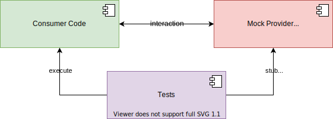
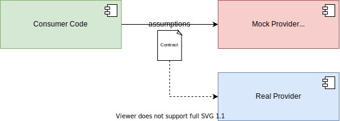
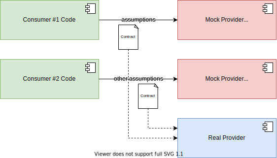

= Contract Testing with PACT, JUnit 5 and Spring Boot

This Showcase demonstrates how PACT can be used to decouple _consumer - provider_ relationships during testing.

Most of the manageable / testable risk in consumer to provider (e.g. service to service, frontend to backend etc.) communication over HTTP is semantic in nature.
No amount of testing will guarantee that the provider will not exhibit unexpected behaviour at runtime.
What can actually be tested in a reliable and reproducible way is the semantics of the communication - basically "do both parties speak the same language?".
This is where (consumer-driven) contracts and PACT come into play.

== Consumer - Provider Relationship

With most HTTP-based APIs the consumer - provider relationship is based on a request - response model:

Each _request_ with its corresponding _response_ can be viewed as a single _interaction_.
Each kind of interaction with all its relevant permutations is the basis for the test that need to be executed when validating functionality.

== "Classic" Approaches

In general there are two kinds of automated tests that are written on the consumer-side for validating _interactions_ with a given provider:

**Tests with Service-Simulation:**

These tests are based on the consumer's assumptions, generally derived from some kind of API documentation, about the provider's behaviour and request - response data model.
Since assumptions might be wrong or outdated, relying on these kinds of tests as the _only_ kind of risk management is a risk in and of itself.

**Integration Tests in a Staging Environment**

These tests are not based on anyone's assumptions.
Instead, the "real" provider is used by the "real" consumer in some kind of staging environment.
On the one hand, these kinds of tests are generally the closest we can come to verifying the "real" behaviour of the consumer - provider relationship.
On the other hand, maintaining test data, current versions of the provider, configuration, etc. of these staging environments requires an enormous effort of time and money for a comparable small return of investment.

== PACT Contracts

Combining both approaches by moving most testing effort from _full_ integration tests on a staging environment to the much faster, and cheaper service-simulator approach is generally a good idea.
As an example, the integration test could be limited to one or two _happy path_ min/max cases while most of the error handling is done using the simulation approach.
Without some way of validating the consumer's assumptions against the actual provider, there will always be unmanaged risk and a need for some kind of integration testing.

What if we could record our simulated _interactions_ and use these records in our provider-side testing?

That's exactly what PACT is doing:

On the consumer-side, PACT provides a DSL for defining the assumptions about _interactions_ with a provider in the form of contract files ("pacts").
There is one file for each consumer-provider pair.
The file contains all the _interactions_ for that consumer-provider pair regardless of how they are composed into separate test classes.

On the provider-side, PACT provides integrations for different testing frameworks (e.g. JUnit 5).
These integrations provide the means to execute the _interactions_ of one or multiple contract files agains a locally running instance of the provider.
Whether these tests are run using the fully bootstrapped application or just a slice with mocks, is a matter of taste - as long as the contract can be validated.

Most provider APIs will have more than one consumer.

With multiple consumers providing contracts to the same provider, another - more social - benefit comes into play:
The provider now knows about each and every consumer of its API and has knowledge about the data that is actually consumed by someone.
This makes it possible for the API to be changed and know exactly which consumer will be negatively affected by the change.
The provider can than initiate communication with the affected consumer's team and plan the change in a much more effective way than having to start a global deprecation process or whatever other mechanism is used for implementing changes.

== Benefits

1. Cheap and fast tests on the consumer-side.
2. Cheap and fast tests on the provider-side.
3. Involve the provider in the testing efforts without needing to relay on a deployed environment.
4. Give the provider an overview of its consumers.
5. Open communication channels between consumer and provider teams.
6. Focus the needed communication of the provider team on those consumers that actually need to be talked to. (e.g. when upcoming changes to the API would break one or more contracts)

== Showcase

Contains three projects:

**provider:** A simple "Library Service" (as in managing a collection of books).
It demonstrates the provider-side JUnit 5 and Spring Boot integration.

**consumer-one:** A consumer of the Library Service interested in a book's `isbn`, `title` and `authors` attributes.
It demonstrates a simple consumer-side JUnit 5 integration without anything too special.
Except a slightly more complex response expectation.

**consumer-two:** A consumer of the Library Service interested in a book's `isbn`, `title` and `numberOfPages` attributes.
It demonstrates a slightly more complex consumer-side contract using parameterized provider-state expectations.

None of the consumers is interested in a book's `description` attribute.
To demonstrate the advantages contract testing provides, the `description` can be deleted from the provider's `Book` definition without any of the consumers suffering any consequences.
If any of the other attributes is changed at least one, if not both, of the contracts will break.

== Links

- link:https://docs.pact.io[General PACT Documentation]
- link:https://github.com/pact-foundation/pact-jvm/tree/master/consumer[General PACT-JVM Consumer DSL]
- link:https://github.com/pact-foundation/pact-jvm/tree/master/consumer/junit5[JUnit 5 PACT-JVM Consumer Integration]
- link:https://github.com/pact-foundation/pact-jvm/tree/master/provider/junit5[JUnit 5 PACT-JVM Provider Integration]
