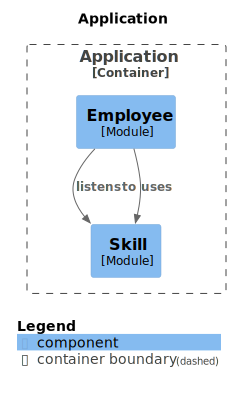

= Spring Modulith

This module demonstrates how to use https://spring.io/projects/spring-modulith[Spring Modulith] to build an application that combines multiple domains into a single runtime while maintaining a modular structure.

> Spring Modulith allows developers to build well-structured Spring Boot applications and guides developers in finding and working with application modules driven by the domain.
It supports the verification of such modular arrangements, integration testing individual modules, observing the application’s behavior on the module level and creating documentation snippets based on the arrangement created.

The example consists of two domain: _Skills_ and _Employees_.
_Employees_ can have _Knowledge_ which links them to the _Skills_.
The dependency between the domains goes from _Employee_ to _Skill_:

.generated module overview diagram

== Features of Spring Modulith

* Architecture verification through link:src/test/kotlin/example/spring/modulith/ArchitectureTests.kt[tests].
* Automatic generation of architecture diagrams and tables through  link:src/test/kotlin/example/spring/modulith/ArchitectureTests.kt[tests].
* Module-scoped integration link:src/test/kotlin/example/spring/modulith/skill/SkillModuleTests.kt[testing].
* In/Out-Box pattern via transactional application events, incl. publish them as external events as well.
* "Moments" events for alternative, event-driven periodic tasks. (e.g. `HourHasPassed`)
