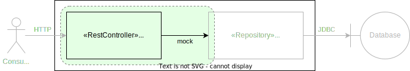

= Testing Basics with JUnit 5 and Spring Boot

This showcase demonstrates the basics of writing efficient automated tests for Spring Boot applications.

*Basic principles:*

- Write isolated unit tests for your own code.
- Write small specific technology-integration tests for _your_ usage of Spring Boot features and other used technologies like databases, message brokers, HTTP clients etc.
- Write a few very high level application end-to-end smoke tests to verify that everything fits together.

== Backend Test Automation Pyramid

The "Test Pyramid" is a simplified model describing how software testing should be done in different levels of granularity and how many tests should be on which level.
A very good article about that topic was written by _Ham Vocke_ in 2018 and published on _Martin Fowler's_ Blog titled link:https://martinfowler.com/articles/practical-test-pyramid.html[The Practical Test Pyramid].

Based on that generalized model, a _test automation focused_ pyramid for backend applications could look something like this:

image::../assets/images/pyramide.svg[align="center"]

Let's dive deeper into this model with the help of a simplified application slice:

image::../assets/images/starter_app_slice.svg[align="center"]

This application manages book of a library.
It offers an HTTP API for consumers and data is stored in an SQL database.

=== Functional Unit Tests

Unit tests are written to make sure that the code _you_ have written does exactly what it is supposed to do.
Depending on what the code under test actually does, unit tests can be divided into several groups:

- link:https://en.wikipedia.org/wiki/Pure_function[Pure Functions]: Tests will vary different input parameter combinations and check that the result is equal to what is expected.
- Stateful Functions: For these functions, the result of their invocation is dependent on the state of their parent component (e.g. objects).
Tests usually involve setting up a new instance for each test.
Other than that the tests themselves are pretty similar to those of pure functions.
- Orchestration Components: These components "orchestrate" the invocation and data transfer of multiple dependency components in order to achieve an overarching functionality.
Their tests usually involve mocking the behaviour of the different dependencies and focus on verifying that concerns like error handling, invocation order, correct data transfer etc. are handled as intended.

Because unit tests only refer to your own code and everything else is mocked, they are extremely fast and can be run by the thousands in a very short time.
This makes them the best tests to get quick feedback on the core components, e.g. the business logic, of your application.

In our example application, unit tests would be used mainly in the _BookCollection_ component.

image::../assets/images/starter_app_slice_unit.svg[align="center"]

**Important Methods and Technologies:**

- link:https://mockk.io[MockK] for mocking dependencies
- link:https://assertj.github.io/doc/[AssertJ] for additional assertions

=== Technology Integration Tests

Technology integration tests are used to verify code that _you have written to use_ a particular technology.
Examples include, but are not limited to:

- HTTP endpoints (`@Controller`, `@RestController`)
- caching (`@Cachable`)
- transactions (`@Transactional`)
- asynchronous invocation (`@Async`)
- event handling (`@EventListener`)
- method-level security (`@RolesAllowed`, `@PreAuthorize`, `@PostAuthorize`, `@Secured`)
- web security configuration
- database access (`JpaRepository`, `MongoRepository`, `JdbcTemplate` etc.)
- HTTP client calls (`RestTemplate`, `HttpClient`, `WebClient` etc.)

The goal is not to check if a given technology works.
Instead, it is to check if _you_ are using the technology correctly to achieve _your goal_.

As an example, let's assume that you are connecting to a SQL database using JDBC and have written a SQL query to read some data.
You don't need to test that the JDBC driver or the database works.
What you need to test is whether you have written valid SQL that will return the desired result when used with a particular database.

Since technology integration tests involve bootstrapping some kind of technology (external services, framework features etc.), they are a lot slower that unit tests.
At least the initial setup will usually take a couple of seconds, while each single test will most likely take only a couple of milliseconds.

In our example application, technology integration tests would be used to test the in the _BookRestController_ and _BookRepository_ components.

image::../assets/images/starter_app_slice_ti.svg[align="center"]

**Important Methods and Technologies:**

- link:http://wiremock.org[WireMock] for simulating external HTTP services
- link:https://www.testcontainers.org[Testcontainers] for running and managing Docker containers in your tests (e.g. for databases)
- Spring Boot Test Slices (`@WebMvcTest`, `@JpaTest`, `@SpringBooTest(classes=[MyCustomConfig::class])` etc.)

=== End-to-End Tests

End-to-end tests are written from the perspective of a user of our software.
Particularly crucial here is which options the user has for interacting with the application under test.
Frontend single-page applications are usually tested end-to-end using a browser and the backend is simulated.
Meanwhile, backend applications, which are our focus here, are tested using their API.
Any Dependencies, like other services or databases, are either simulated or replaced by test instances.

Questions that end-to-end tests can answer, and a combination of just unit and technology integration tests can't:

- _Does my application start given a default configuration?_
-> Do all my components fit and are all required compontents part of the application context.
- _Does my global error handling work for all of my endpoints?_
-> If there are global error handlers, testing them in each and every relevant technology integration test is error-prone (you might forget them) and redundant.
- _Do my global security rules work?_
-> A lot of security aspects are defined globally.
So the same logic as for global error handlers applies here.

In addition to questions like this, it is generally useful to include a couple of _smoke_ tests.
These kinds of tests execute one or two happy path scenarios per endpoint, just to see that the whole control flow from request to response works.
Basically if "everything fits and works together".

In our example application, the end-to-end tests would use the _BooksRestController's_ HTTP endpoints and the _BooksRepository's_ database would be a test instance.

image::../assets/images/starter_app_slice_e2e.svg[align="center"]

The scope of an end-to-end test starts with the available input channels of the application under test as they would be used in production and ends where the application's responsibility ends.

== Architecture & Testability

The impact of an application's architecture on its overall testability can be demonstrated using the following three examples.
Let's start with a rather abstracted and well-structured architecture and degrade that abstraction with each following example:

=== Example #1

Architecture #1 is basically the classical 3 layer architecture:

1. The _BooksRestController_ handles the translation of the HTTP protocol, and the _public language_ (external model) into business logic, and the internal domain model.
2. The _BooksCollection_ handles all core business logic and acts exclusively on the internal domain model.
3. The _BooksRepository_ is responsible for the persistence of the state of the internal domain model in some kind of database.

Having a clear separation of concerns with each component focusing on a single job (e.g. translating business logic into SQL), it is very easy to also write tests that focus on that job and do not need to take too much else into consideration.

==== Unit Tests

The _BooksCollection_ can be 100% unit tested, since it does not rely on any outside technology.
This component als contains all the important core behaviour for handling books.
What one might call _business logic_.

The dependency to the _BooksRepository_ is mocked and therefore completely under the tests' control.
So in this architecture our feedback loop for the most important parts of our application is very fast.

Both the _BooksRestController_ and _BooksRepository_ are such small components, who's only task is to translate business calls from and to a specific technology, that their unit tests would cover the same scenarios that their technology integration will have to cover anyway.
Therefore, unit tests for these components are not necessary.

==== Technology Integration Tests

Both the _BooksRestController_ and _BooksRepository_ components handle integration with different technologies.

image::../assets/images/starter_design1_ti.svg[align="center"]

_BooksRestController_ handles HTTP communication and translates our _public language_ into our internal domain model.
Tests for this component should therefore involve HTTP and focus on whether requests are understood and responses are created correctly.
(`@WebMvcTest`, `@WebFluxTest`)

_BooksRepository_ takes our SQL commands and uses a JDBC driver to talk to a database.
Tests for this component should involve a database in order to validate our commands are correctly written.
(`@JdbcTest`, `@DataJdbcTest`, `@DataJpaTest`, `@DataMongoTest`,etc)

==== End-to-End Tests

In this architecture, since everything else is already tested either by unit or by technology integration tests, the only tests remaining are:

- Global security rules.
- Happy path _smoke_ tests.

image::../assets/images/starter_design1_e2e.svg[align="center"]

With those, our application is thoroughly tested and ready to be deployed.

=== Example #2

Architecture example #2 removes the "business" layer, or more general the technology-independent components.
Leaving the _BooksRestController_ to interact directly with the _BooksRepository_.

image::../assets/images/starter_design2.svg[align="center"]

This mix of responsibilities for the _BooksRestController_ has an immediate impact on the lower levels of the test automation pyramide.

==== Unit & Technology Integration Tests

The two remaining components from example #1 contain technology specific code, which needs to be tested with technology integration tests.
There are no real _purely_ unit testable components left.
But because the _business logic_ has to go somewhere, it is more than likely that all of that code would now be part of the _BooksRestController_.

This makes _BooksRestController_ the one component that now does two things: Translating our _public language_ from HTTP and executing _business logic_ upon these requests.
Therefore, it might be useful to write both unit and technology integration tests for this component.

Writing those unit tests in a sustainable manner can be hard though.
Instead of writing tests which represent business rules and are based on business inputs and outcomes (aka the _value_ of your code), the tests now need to start and end with a technical perspective.
Technical data (e.g. request headers, query parameters, request / response abstractions etc.) need to be simulated as input.
That makes it hard to write tests that focus on those business value of your code.

Along with the new challenges for unit tests, the technology integration tests are harder to write as well.

image::../assets/images/starter_design2_ti.svg[align="center"]

While the _BooksRestController_ tests of example #1 could focus solely on testing the translation of HTTP requests into responses, they now need to know all the business rules as well.
Just writing an example request and checking if the _BookCollection_ mock is invoked with the correct parameter is not possible when the requests are directly translated into actions and side effects.

==== End-to-End Tests

As with example #1, everything else is already tested either by unit or by technology integration tests, the only tests remaining are:

- Global security rules.
- Happy path _smoke_ tests.

image::../assets/images/starter_design2_e2e.svg[align="center"]

With those, our application is thoroughly - but also more challengingly - tested and ready to be deployed.

=== Example #3

Example #3 removes all concepts of separation of concern / layers and puts the _BooksRestController_ in charge of everything.
From translating the _public language_ to interacting directly with the database, all while also containing any _business logic_.
Basically there is no architecture, but there is a big ball of mud.

Doing this, kills any hope for writing small and focused tests or having different kinds of tests at all.
Purely technical white-box unit tests for a single do-it-all component are basically unmaintainable.
Each tests setup has to consider which database state to set up based on which logical path will be traversed based on a specific HTTP request.
This makes the tests fragile, complex to write and hard to understand.

Without other components to mock, there is also no real advantage to writing technical integration tests.
Bootstrapping the application only partially does not really save any startup time but does add a lot more complexity.
Simply writing everything as end-to-end tests is usually the only option left.

=== Conclusion

With fewer abstractions in the production code, the ability to write efficient unit tests also decreases.
From architecture #1 to #2 the difference is not yet as serious as from #2 to #3, so there is a point at which not all aspects of the application are testable without excessive effort.
The basic principle is: The more abstract (smaller parts) the production code is structured, the more of it can be verified purely with unit and individual technology integration tests.
