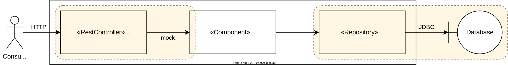
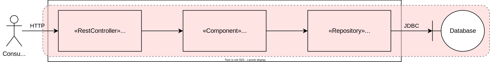
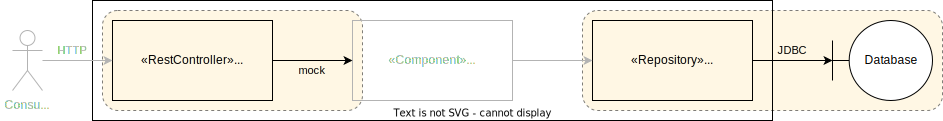
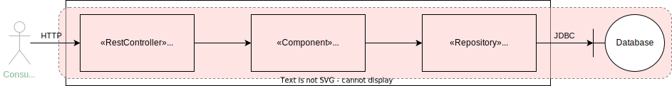
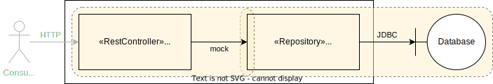
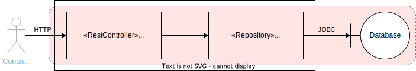

= Testing Basics with JUnit 5 and Spring Boot

This showcase demonstrates the basics of writing efficient automated tests for Spring Boot applications.

*Basic principles:*

- Write isolated unit tests for your own code.
- Write small specific technology-integration tests for _your_ usage of Spring Boot features and other used technologies like databases, message brokers, HTTP clients etc.
- Write a few very high level application end-to-end smoke tests to verify that everything fits together.

== Test Automation Pyramid

The "Test Pyramid" is a simplified model describing how software testing should be done in different levels of granularity and how many tests should be on which level.
A very good article about that topic was written by _Ham Vocke_ in 2018 and published on _Martin Fowler's_ Blog titled link:https://martinfowler.com/articles/practical-test-pyramid.html[The Practical Test Pyramid].

Based on that generalized model, a _test-automation focused_ pyramid could look something like this:

image::../../assets/images/pyramide.svg[align="center"]

Let's look deeper into this model with the help of a simplified application slice:

This application manages book of a library.
It offers an HTTP API for consumers and data is stored in an SQL database.

=== Functional Unit Tests

Unit tests are written to make sure that the code _you_ have written does exactly what it is supposed to do.
Depending on what the code under test actually does, unit tests can be divided into several groups:

- link:https://en.wikipedia.org/wiki/Pure_function[Pure Functions]: Tests will vary different input parameter combinations and check that the result is equal to what is expected.
- Stateful Functions: For these functions, the result of their invocation is dependent on the state of their parent component (e.g. objects).
Tests usually involve setting up a new instance for each test.
Other than that the tests themselves are pretty similar to those of pure functions.
- Orchestration Components: These components "orchestrate" the invocation and data transfer of multiple dependency components in order to achieve an overarching functionality.
Their tests usually involve mocking the behaviour of the different dependencies and focus on verifying that concerns like error handling, invocation order, correct data transfer etc. are handled as intended.

Because unit tests only refer to your own code and everything else is mocked, they are extremely fast and can be run by the thousands in a very short time.
This makes them the best tests to get quick feedback on the core components, e.g. the business logic, of your application.

In our example application, unit tests would be used mainly in the _BookCollection_ component.

**Important Methods and Technologies:**

- link:https://mockk.io[MockK] for mocking dependencies
- link:https://assertj.github.io/doc/[AssertJ] for additional assertions

=== Technology Integration Tests

Technology integration tests are used to verify code that _you have written to use_ a particular technology.
Examples include, but are not limited to:

- HTTP endpoints (`@Controller`, `@RestController`)
- caching (`@Cachable`)
- transactions (`@Transactional`)
- asynchronous invocation (`@Async`)
- event handling (`@EventListener`)
- method-level security (`@RolesAllowed`, `@PreAuthorize`, `@PostAuthorize`, `@Secured`)
- web security configuration
- database access (`JpaRepository`, `MongoRepository`, `JdbcTemplate` etc.)
- HTTP client calls (`RestTemplate`, `HttpClient`, `WebClient` etc.)

The goal is not to check if a given technology works.
Instead, it is to check if _you_ are using the technology correctly to achieve _your goal_.

As an example, let's assume that you are connecting to a SQL database using JDBC and have written a SQL query to read some data.
You don't need to test that the JDBC driver or the database works.
What you need to test is whether you have written valid SQL that will return the desired result when used with a particular database.

Since technology integration tests involve bootstrapping some kind of technology (external services, framework features etc.), they are a lot slower that unit tests.
At least the initial setup will usually take a couple of seconds, while each single test will most likely take only a couple of milliseconds.

In our example application, technology integration tests would be used to test the in the _BookRestController_ and _BookRepository_ components.

**Important Methods and Technologies:**

- link:http://wiremock.org[WireMock] for simulating external HTTP services
- link:https://www.testcontainers.org[Testcontainers] for running and managing Docker containers in your tests (e.g. for databases)
- Spring Boot Test Slices (`@WebMvcTest`, `@JpaTest`, `@SpringBooTest(classes=[MyCustomConfig::class])` etc.)

=== End-to-End Tests

End-to-end tests are written from the perspective of a user of our software.
Particularly crucial here is which options the user has for interacting with the application under test.
Frontend single-page applications are usually tested end-to-end using a browser and the backend is simulated.
Meanwhile, backend applications, which are our focus here, are tested using their API.
Any Dependencies, like other services or databases, are either simulated or replaced by test instances.

Questions that end-to-end tests can answer, and a combination of just unit and technology integration tests can't:

- _Does my application start given a default configuration?_
-> Do all my components fit and are all required compontents part of the application context.
- _Does my global error handling work for all of my endpoints?_
-> If there are global error handlers, testing them in each and every relevant technology integration test is error-prone (you might forget them) and redundant.
- _Do my global security rules work?_
-> A lot of security aspects are defined globally.
So the same logic as for global error handlers applies here.

In addition to questions like this, it is generally useful to include a couple of _smoke_ tests.
These kinds of tests execute one or two happy path scenarios per endpoint, just to see that the whole control flow from request to response works.
Basically if "everything fits and works together".

In our example application, the end-to-end tests would use the _BooksRestController's_ HTTP endpoints and the _BooksRepository's_ database would be a test instance.

The scope of an end-to-end test starts with the available input channels of the application under test as they would be used in production and ends where the application's responsibility ends.

== Testability & Design

The impact of an application's design on its testability can be shown with the following 3 designs, in descending order of abstractions:

=== Design #1

Design #1 is basically the classical 3 layer architecture:

1. The _BooksRestController_ handles the translation of the HTTP protocol, and the _public language_ (external model) into business logic, and the internal domain model.
2. The _BooksCollection_ handles all core business logic and acts exclusively on the internal domain model.
3. The _BooksRepository_ is responsible for the persistence of the state of the internal domain model in some kind of database.

image::../../assets/images/starter_design1.svg[align="center"]

==== Unit Tests

The _BooksCollection_ can be 100% unit tested, since it does not rely on any outside technology.
This component als contains all the important core behaviour for handling books.
What one might call _business logic_.

The dependency to the _BooksRepository_ is mocked and therefore completely under the tests control.
So in this design our feedback loop for the most important parts of our application is very fast.

image::../../assets/images/starter_design1_unit.svg[align="center"]

Both the _BooksRestController_ and _BooksRepository_ are such small components, who's only task is to translate business calls from and to a specific technology, that their technology integration will cover everything a unit tests would cover.
Therefore, unit tests for these components are not necessary.

==== Technology Integration Tests

Both the _BooksRestController_ and _BooksRepository_ components handle integration with different technologies.

_BooksRestController_ handles HTTP communication and translates our _public language_ into our internal domain model.
Tests for this component should therefore involve HTTP and focus on whether requests are understood and responses are created correctly.
(`@WebMvcTest`, `@WebFluxTest`)

_BooksRepository_ takes our SQL commands and uses a JDBC driver to talk to a database.
Tests for this component should involve a database in order to validate our commands are correctly written.
(`@JdbcTest`, `@DataJdbcTest`, `@DataJpaTest`, `@DataMongoTest`,etc)

==== End-to-End Tests

In this design, since everything else is already tested either by unit or by technology integration tests, the only tests remaining are:

- Global security rules.
- Happy path _smoke_ tests.

With those, our little application is thoroughly tested and ready to be delpoyed.

=== Design #2

Design #2 removes the "business" layer, or more general the technology-independent components.
Leaving the _BooksRestController_ to interact directly with the _BooksRepository_.

image::../../assets/images/starter_design2.svg[align="center"]

==== Unit Tests

The two remaining components contain technology specific code, which should be tested with technology integration tests.
There are no real _purely_ unit testable components left.
But because the _business logic_ has to go somewhere, it is more than likely that all of that code would now be part of the _BooksRestController_.

This makes _BooksRestController_ the one component that now does two things: Translating our _public language_ from HTTP and executing _business logic_ upon these requests.
Therefore, it could be useful to write both unit and technology integration tests for this component.

image::../../assets/images/starter_design2_unit.svg[align="center"]

Because of the mixture of translation and _business logic_, these unit tests are harder to write.
Depending on what the _BooksRestController_ actually does, we might need to mock HTTP components like requests, responses and consider headers as concrete objects, instead of relying on a more HTTP focused abstraction like `MockMvc` or a `TestWebClient`.

==== Technology Integration Tests

Basically the same setup as in design #1, but with larger components and less clear separation of concerns.
Making it necessary to write more complex tests to verify their behaviour.

As just one example, for the _BooksRestController_:

With this design, our inputs for the tests are still HTTP requests.
But now we need to mock on the level of database operations instead of "business" operations.
This will make the tests generally harder to understand because it is no longer an easier to understand mapping of HTTP method + endpoint to what "business" operation might naturally fit.
Instead, these test now expose much more of the internal structure of the application than with a more abstract design like #1.

==== End-to-End Tests

In this design, since everything else is already tested either by unit or by technology integration tests, the only tests remaining are:

- Global security rules.
- Happy path _smoke_ tests.

With those, our little application is thoroughly tested and ready to be delpoyed.

=== Design #3

Design #3 removes all concepts of separation of concern / layers and puts the _BooksRestController_ in charge of everything.
From translating the _public language_ to interacting directly with the database, all while also containing any _business logic_.

image::../../assets/images/starter_design3.svg[align="center"]

==== Unit Tests

More sharply than with design #2, this design diminishes the usefulness of unit tests for fast feedback by making them basically unmaintainable.
Each tests setup has to consider which database state to set up based on which logical path will be traversed based on a specific HTTP request.
This makes the tests fragile, complex to write and hard to understand.

image::../../assets/images/starter_design3_unit.svg[align="center"]

Writing unit tests for this kind of design is most likely not worth the effort.
The only reason might be to test some kind of exceptional behaviour for cases that cannot be easily provoked in higher level tests.

==== Technology Integration Tests

Similar to why unit tests are not really an option, it would be easier to just use end-to-end tests.

The performance will be basically the same.

==== End-to-End Tests

Without production code abstractions, like separation of concerns, everything is an end-to-end test.

image::../../assets/images/starter_design3_e2e.svg[align="center"]
